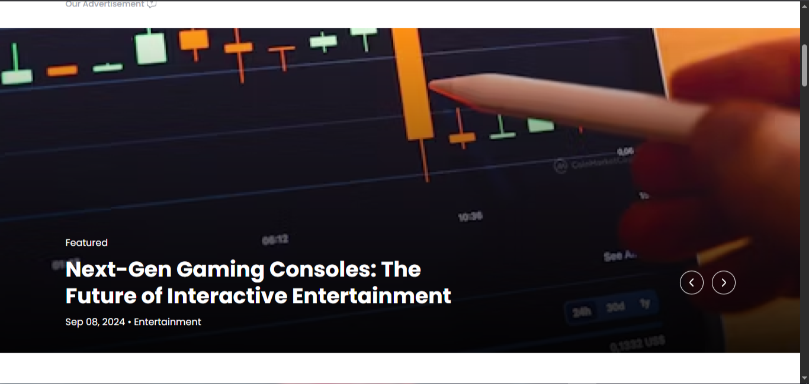
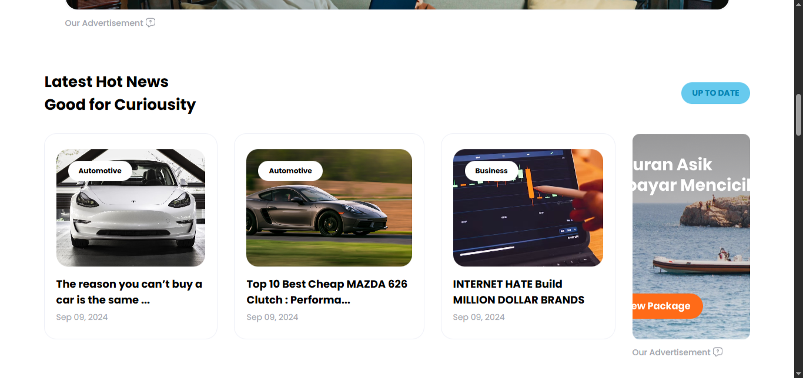
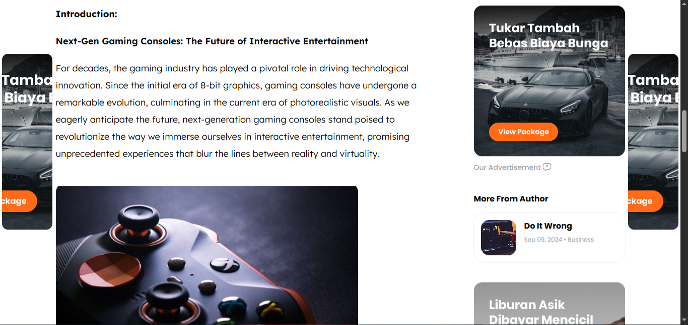

# 📖 Magazine — Aplikasi Portal Berita (Laravel)

<p align="center">
  
  
  
  
</p>

**Ringkasan singkat**

Magazine adalah aplikasi web portal berita/majalah berbasis **Laravel**, cocok untuk portofolio atau sebagai basis untuk membuat media berita sederhana. Proyek ini sudah dilengkapi model untuk artikel, penulis, kategori, banner iklan, dan panel admin menggunakan **Filament**.

---

## ✨ Fitur Utama

- CRUD Artikel (`app/Models/ArticleNews.php`) dengan relasi ke Author & Category
- Manajemen Penulis (`app/Models/Author.php`) & Kategori (`app/Models/Category.php`)
- Banner Ads (`app/Models/BannerAds.php`) untuk promosi
- Panel admin berbasis **Filament** untuk manajemen konten cepat
- UI modern & responsif dengan **Tailwind CSS** dan bundling via **Vite**
- Seeder & migrasi siap pakai untuk pengujian data

---

## 🧭 Teknologi

- PHP 8.1+
- Laravel
- Composer
- Node.js & npm/Yarn
- Tailwind CSS, Vite, Livewire, Filament
- MySQL/MariaDB (atau SQLite untuk development cepat)

---

## 🚀 Instalasi & Menjalankan (Windows)

1. Clone repo:

   ```bash
   git clone https://github.com/Olfatalatas/magazine.git
   cd magazine
   ```

2. Install dependensi PHP:

   ```bash
   composer install
   ```

3. Salin file env dan generate key:

   ```powershell
   copy .env.example .env
   php artisan key:generate
   ```

   - Atur konfigurasi database di `.env` (`DB_*`).

4. Migrasi & seeding:

   ```bash
   php artisan migrate --seed
   ```

5. Link storage (jika perlu):

   ```bash
   php artisan storage:link
   ```

6. Install & build assets:

   ```bash
   npm install
   npm run dev    # untuk development
   npm run build  # untuk production
   ```

7. Jalankan server:

   ```bash
   php artisan serve
   ```

   Buka http://127.0.0.1:8000

---

## 🖼️ Screenshots

<p align="center">
  
  
  
</p>

<p align="center">
  <sub><strong>Preview:</strong> Landing page dan detail berita.</sub>
</p>

---


## ✅ Menjalankan Test

- Jalankan test:
  ```bash
  php artisan test
  # atau
  vendor/bin/phpunit
  ```

---

## 📁 Struktur Penting

- `app/Models/ArticleNews.php` — Model artikel
- `app/Models/Author.php` — Model penulis
- `app/Models/Category.php` — Model kategori
- `app/Models/BannerAds.php` — Model banner iklan
- `routes/web.php` — Routing front-end
- `database/migrations/`, `database/seeders/` — Skema & data contoh
- `resources/views/` — Blade templates

---


## 🤝 Kontribusi

- Fork → Buat branch `feature/*` → Pull Request
- Sertakan deskripsi, langkah reproduksi (untuk bug), dan test jika relevan

---

## 📬 Kontak & Lisensi

- Repo: `https://github.com/Olfatalatas/magazine`
- Lisensi: **MIT**

---